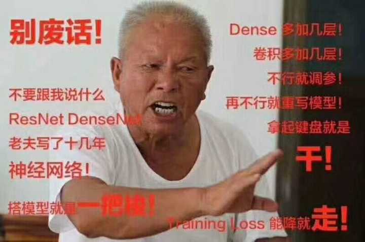

# mxnetgo

[](https://travis-ci.org/dongzhuoyao/mxnetgo)

a  simple scaffold of MXNet, easy to customize, extremely boosting your research. more examples will be provided.

the target is to make MXNet research as easy as "YiBaSuo".


# Examples

currently available example: [Deeplab](example/deeplab)

# Characteristics

* no document, because it's very simple to use for anyone who has a basic programming skill.

* a very good starter for research, all you need write only is the network structure.

* modularization for specific task, such as image segmentation, pose estimation etc. 

* reproducible, every experient can produce the same result as the paper indicated.

# Install

Dependencies:

* python2(python3 is current not compatible)

* mxnet==1.0.0

```
pip install -U git+https://github.com/dongzhuoyao/tensorpack.git
# or add `--user` to avoid system-wide installation.
```

## TODO
- [ ] hourglass
- [ ] resnet101 model train
- [ ] deeplab result reproduce
- [ ] DUC
- [ ] PSPNet 
- [ ] Non Local Block
- [ ] large kernel

future work: [In-Place Activated BatchNorm for Memory-Optimized Training of DNNs](https://arxiv.org/abs/1712.02616)

## Schedule

*  2.14  Deeplabv2 PSPNet PascalVOC 85.4
*  3.1   Large Kernel
*  3.15  SENet, Hourglass


## Acknowledgement

Some of the example codes are based on others' codes. thanks for their contributions. if this example helps you, please citate their papers.


April, 10
