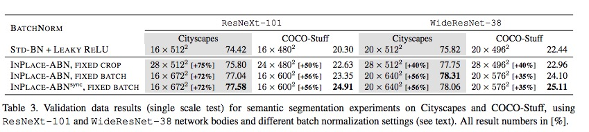

# Result in Mxnetgo

Deeplab Paper result: MSC+Coco+Aug+ASPP+CRF=77.69% mIoU

## Pascal 
|                                   | mIoU(official,8GPU) |  mIoU(my)|
|-----------------------------------|------|------|
|deeplabv1.pascal(resnet101)| 70.7 |**73.7**(without Coco,ASPP,CRF)|
|deeplabv1.pascal.4gpu.scale16(resnet101)|70.7|**71.7**|
|deeplabv1.pascal.dcn(resnet101)| 75.9 |  **74.7**|

## Cityscapes

Deeplab Paper result: Full+Aug+ASPP+CRF=71.4% mIoU

|                                   | mIoU(official,8GPU) | mIoU(my)  |
|-----------------------------------|------|-------|
|deeplabv1.cs.scale4.officiallr.full.longer(resnet101)|70.3|**69.4**|
| Deformable DeepLab, ResNet-v1-101(resnet101) | 75.2 |-- |

more experimental result can be seen in [NOTE](tmp/NOTE.md)

## some notes

* lr schedule is very important, in most tensorflow framework, the lr schedule is [(3, 1e-4), (5, 1e-5), (7, 8e-6)] with Adam, however, in mxnet, as paper indicated. the lr schedule is [(4, 1e-3), (6, 1e-4)] with SGD(total 30k iterations).

* large image size can bring about  nearly 1% gain in image segmentation.

* how much gain dilation convolution  can bring need more experiments to explore.

* RandomResize image with a nearest-neighbor interpolation can slightly increase mIoU by 0.8%???

* iteration number is important or total image numbers?

* To stable the statistics of the BatchNormormalization, the combination of the image size and batch size should tuned accurately as indicated in [InPlace-ABN](https://arxiv.org/abs/1712.02616)

here some other method' choice as follows:

|      Method                             | image crop size | batch size(single gpu)  |
|-----------------------------------|------|-------|
|deeplabv2-resnet101|321|10|
|deeplabv3-resnet101|513x513|as max as possible|
|PSPNet_VOC2012-resnet101|473|as max as possible|
|PSPNet_Cityscapes-resnet101|713|as max as possible|
|Inplace_ABN_Cityscapes-resnext101|672|16|
|Inplace_ABN_CocoStuff-resnext101|600|16|
|DeformableConvolutionNetworks-Deeplab-Cityscapes| 768*1024|1|
|DeformableConvolutionNetworks-Deeplab-PascalVOC| 768*1024|1|

* In the Cityscapes experiment, batch size=1, image size= 1024*2048, tensorflow can only train 66% result, while mxnet could train 70.45 result. why?

* In Deformable paper, the Pascal VOC is 30K iters, Cityscapes is 45 iters. However in PSPNet paper, the Pascal VOC is 30 iters, Cityscapes is 90 iters.

* In PSPNet, ADE20K dataset, with the same setting, increasing the depth
of ResNet from 50 to 269 can improve the score of (Mean
IoU + Pixel Acc.) / 2 (%) from 60.86 to 62.35, with 1.49 absolute
improvement.(from 100 to 269 can bring 1.05% gain)

